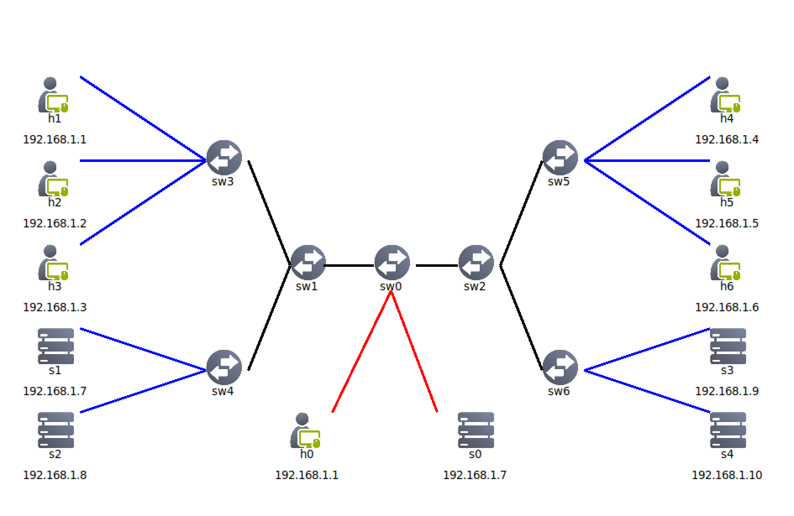

# README


python3 -m pip install PyQt5 pyautogui pyte pexpect
# Network Softwarization - Network Slicing - Mottola Gabriele #

The network represents a hypothetical school lab network consisting of two labs, named lab1 and lab2, and an IT office. Each lab comprises three hosts representing students, and there are two servers. In the IT office, there is one admin station and one server.

## Short Introduction ##



## Project Description: Emergency Network Slicing ##
The text describes a hypothetical school lab network featuring two labs, lab1 and lab2, along with an IT office. Each lab is equipped with three hosts representing students, and there are two servers in total. Within the IT office, there is an admin station and a server.
Three scenarios have been implemented: normal (all working), full (high request), and isolated (network issues).


This folder contains the following files:
1. my_network.py: Python script to build a network with seven hosts, five sercers, six switchs and the respective links.

2. normal_scenario.sh: Bash script that automatically build two virtual queues ....

3. full_scenario.sh: Bash script that automatically build two virtual queues ....

4. isolated_scenario.sh: Bash script that automatically build three virtual queues ....


4. slicing_scenario.py: Application that utilizes the aforementioned scripts in an automatic manner, in order to dynamically implement the network slicing strategy. This is the original file minus the automatical change

### How to Run ###
You can simply run the emulation application with the following commands in this folder.

1. Start the program that automatically anable the manager, start the network:
```bash
$ python3 program.py
```

2. Starting the network using the button **START**
```text
Now the console appears. The buttons for the states are enabled.
```

## How to Verify ##


1. ping mode: verifying connecitvity, e.g.:
*Case 1: Normale state* 
```bash
mininet> pingall
*** Ping: testing ping reachability
h0 -> X  X  X  X  X  X  X  s0 X  s2 X  s4
h1 -> X  X  X  X  X  X  X  X  s1 X  s3 X
h2 -> X  X  X  X  X  X  X  X  s1 X  s3 X
h3 -> X  X  X  X  X  X  X  X  s1 X  s3 X
h4 -> X  X  X  X  X  X  X  X  s1 X  s3 X
h5 -> X  X  X  X  X  X  X  X  s1 X  s3 X
h6 -> X  X  X  X  X  X  X  X  s1 X  s3 X
s0 -> h0 X  X  X  X  X  X  X  X  s2 X  s4
s1 -> X  h1 h2 h3 h4 h5 h6 X  X  X  X  X
s2 -> h0 X  X  X  X  X  X  s0 X  X  X  s4
s3 -> X  h1 h2 h3 h4 h5 h6 X  X  X  X  X
s4 -> h0 X  X  X  X  X  X  s0 X  s2 X  X

*** Results: 74% dropped (34/132 received)
```


*Case 2: Full Scenario* 
```bash
mininet> pingall
*** Ping: testing ping reachability
h0 -> X  X  X  X  X  X  X  s0 X  X  X  X
h1 -> X  X  X  X  X  X  X  X  s1 s2 s3 s4
h2 -> X  X  X  X  X  X  X  X  s1 s2 s3 s4
h3 -> X  X  X  X  X  X  X  X  s1 s2 s3 s4
h4 -> X  X  X  X  X  X  X  X  s1 s2 s3 s4
h5 -> X  X  X  X  X  X  X  X  s1 s2 s3 s4
h6 -> X  X  X  X  X  X  X  X  s1 s2 s3 s4
s0 -> h0 X  X  X  X  X  X  X  X  X  X  X
s1 -> X  h1 h2 h3 h4 h5 h6 X  X  X  X  X
s2 -> X  h1 h2 h3 h4 h5 h6 X  X  X  X  X
s3 -> X  h1 h2 h3 h4 h5 h6 X  X  X  X  X
s4 -> X  h1 h2 h3 h4 h5 h6 X  X  X  X  X
*** Results: 62% dropped (50/132 received)
```
*Case 3: Isolated Scenario* 
```bash
mininet> pingall
*** Ping: testing ping reachability
h0 -> X  X  X  X  X  X  X  s0 s1 s2 s3 s4
h1 -> X  X  X  X  X  X  X  X  s1 s2 X  X
h2 -> X  X  X  X  X  X  X  X  s1 s2 X  X
h3 -> X  X  X  X  X  X  X  X  s1 s2 X  X 
h4 -> X  X  X  X  X  X  X  X  X  X  s3 s4
h5 -> X  X  X  X  X  X  X  X  X  X  s3 s4
h6 -> X  X  X  X  X  X  X  X  X  X  s3 s4
s0 -> h0 X  X  X  X  X  X  X  s1 s2 s3 s4
s1 -> h0 h1 h2 h3 X  X  X  s0 X  X  X  X
s2 -> h0 h1 h2 h3 X  X  X  s0 X  X  X  X
s3 -> h0 X  X  X  h4 h5 h6 s0 X  X  X  X
s4 -> h0 X  X  X  h4 h5 h6 s0 X  X  X  X
*** Results: 68% dropped (42/132 received)
```

2. client mode: verifying flows in each router and check the virtual queues/slices, e.g.:
```bash
mininet> sh ovs-ofctl dump-flows sw0
```

```bash
mininet> sh ovs-ofctl dump-flows sw3
```

```bash

mininet> sh ovs-vsctl list queue
```

3. iperf mode: verifying slices' bandwidth:
*Case 1: Normal Scenario* 
```bash
mininet> iperf h1 s1
*** Iperf: testing TCP bandwidth between h1 and h4 
*** Results: ['42.6 Mbits/sec', '43.1 Mbits/sec']
mininet> iperf s2 s0
*** Iperf: testing TCP bandwidth between h2 and h5 
*** Results: ['79.2 Mbits/sec', '80.8 Mbits/sec']
```
*Case 2: Full Scenario* 
```bash
mininet> iperf h1 s1
*** Iperf: testing TCP bandwidth between h1 and h4 
*** Results: ['60.4 Mbits/sec', '63.1 Mbits/sec']
mininet> iperf h0 s0
*** Iperf: testing TCP bandwidth between h2 and h5 
*** Results: ['78.5 Mbits/sec', '79.3 Mbits/sec']
```

*Case 3: Isolated Scenario* 
```bash
mininet> iperf h1 s1
*** Iperf: testing TCP bandwidth between h1 and h4 
*** Results: ['18.7 Mbits/sec', '19.6 Mbits/sec']
mininet> iperf h4 s3
*** Iperf: testing TCP bandwidth between h1 and h4 
*** Results: ['18.6 Mbits/sec', '19.7 Mbits/sec']
mininet> iperf h0 s0
*** Iperf: testing TCP bandwidth between h2 and h5 
*** Results: ['80.5 Mbits/sec', '81.8 Mbits/sec']
mininet> iperf s0 s2
*** Iperf: testing TCP bandwidth between h2 and h5 
*** Results: ['75.9 Mbits/sec', '77.4 Mbits/sec']
```


4. iperf mode: verifying slices' bandwidth, e.g. (in both emergency/non-emergency situations):

Start listening on the h4 as server and use h1 as client:
```bash
mininet> s1 iperf -s -b 2.5M &
mininet> h1 iperf -c h4 -b 2.5MB -t 10 -i 1
```

Start listening on the h5 as server and use h2 as client:
```bash
mininet> s3 iperf -s -b 2.5M &
mininet> h4 iperf -c h5 -b 2.5M -t 10 -i 1
```

Start listening on the h6 as server and use h3 as client:
```bash
mininet> s0 iperf -s -b 3.5M &
mininet> s2 iperf -c h6 -b 3.5M -t 10 -i 1
```

## Implementation Details ##
The network represents a hypothetical school lab network consisting of two labs, named lab1 and lab2, and an IT office. Each lab comprises three hosts representing students, and there are two servers. In the IT office, there is one admin station and one server.

In the normal state, students cannot communicate with each other across labs but can access services within their own lab. Each lab has a dedicated server (S1 for lab1 and S3 for lab2). Additionally, the IT office can access servers S2 and S4, which serve as backup servers.

During peak times, known as the full state, servers S2 and S4 are available to handle student requests. However, during this period, the IT office loses access to S2 and S4.

In the isolated state, assumed during network issues, basic functionality is preserved. Lab1 students can only access servers S1 and S2, while lab2 students can only access servers S3 and S4. The IT office retains access to all servers for verification purposes.


Note: When using a terminal opened with Python, you may encounter some issues after pressing Control-C. This problem is caused by the terminal and the operating system implementation. An important future implementation should address this issue. The easiest solution is to retype Control-C. There are no ideas why this works.


### Original Authors

The Contributors of the original project, and the main maintainers, are the following:
- Georgios Fragkos: gfragkos@unm.edu 
- Nathan Patrizi  : npatrizi@unm.edu 
